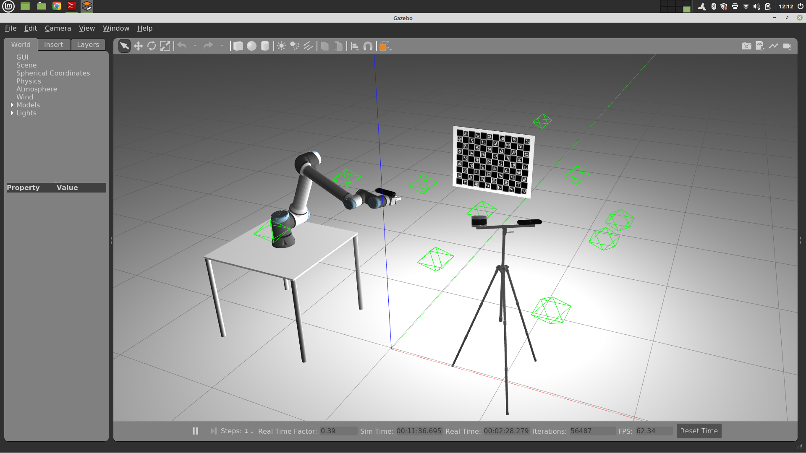
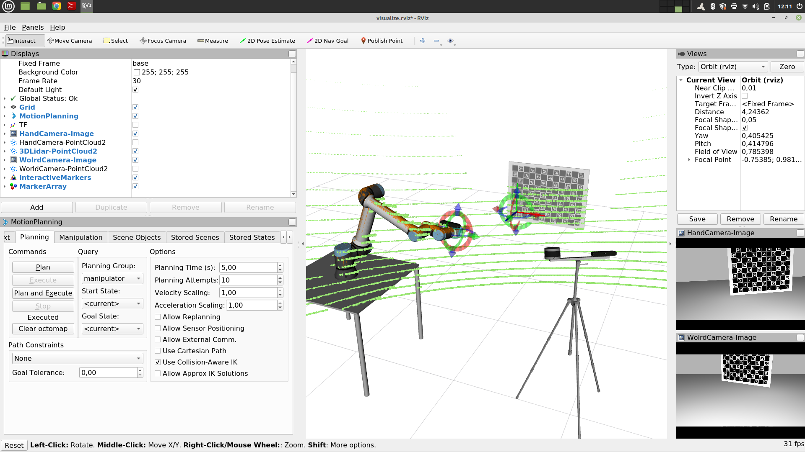

# mmtbot

**M**ulti-**M**odal **T**est **B**ot (mmtbot) is a conceptual robot designed to test advanced calibration methodologies. The system contains the following sensors:

- **3dlidar** - A 3D LiDAR mounted on a tripod
- **world_camera** - An RGB-D camera mounted on the same tripod
- **hand_camera** - A second RGB-D camera mounted on the manipulator's end effector link





# Installation

##### Clone dependencies:
```
cd <path_to_catkin_ws>/src
git clone https://github.com/iris-ua/iris_ur10e -b noetic-devel
git clone https://github.com/iris-ua/iris_ur10e_calibration -b noetic-devel
git clone https://bitbucket.org/DataspeedInc/velodyne_simulator -b master
```

##### Install packages:
```
sudo apt install ros-<version>-moveit*
sudo apt install ros-<version>-warehouse-ros*
sudo apt install ros-<version>-joint-trajectory-controller
sudo apt install libignition-common3 libignition-common3-graphics
```

##### Add to .bashrc:
```
export ROS_BAGS="/home/<username>/bagfiles"
export ATOM_DATASETS="/home/<username>/datasets"
export GAZEBO_MODEL_PATH="`rospack find mmtbot_gazebo`/models:${GAZEBO_MODEL_PATH}"
```


# Running the simulation to collect a bag file:

To run the system with simulation use:

    roslaunch mmtbot_gazebo mmtbot.launch gui:=true sim:=true moveit:=true

Setting gui:=false will not launch gazebo which will make it faster.

Then you can record a bag file

    roslaunch mmtbot_bringup record.launch bag:=/home/mike/Desktop/mmtbot.bag

After having a bagfile now you just calibrate as you did before with any atom robot calibration procedure.

# Using test Bagfiles and Datasets 

To test you can use the bag file at:

https://drive.google.com/file/d/1DLZhHq-Nnrr4X_5HdkEC0HZFrcToEamy/view?usp=sharing

and the dataset at:

https://drive.google.com/file/d/1jH0SCtQxJQ3FDaXeblVNVGjNkygJW41y/view?usp=sharing

