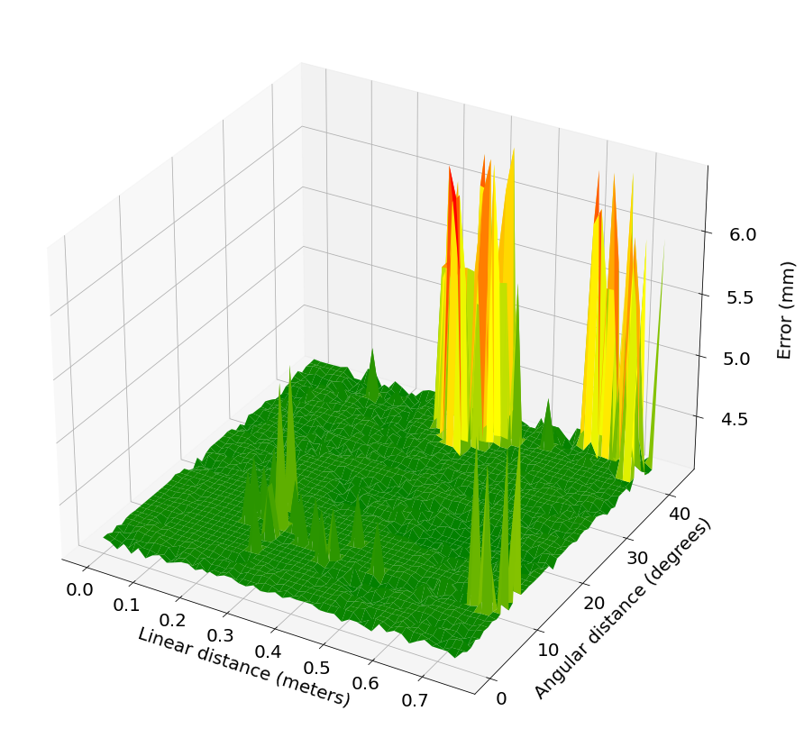

# Experiment 1: Impact of the initial estimate on the calibration error.

The goal is to vary the linear and angular distance from the initial estimate to the ground truth sensor pose, which is know since mmtbot is a simulated robotic system.

https://github.com/lardemua/atom/issues/281

## Proceduce 

Which commands do you run ?

## Files

#### batch_mmtbot.yml

Contains the configuration to run many calibrations with the several linear and angular distance values.

#### mmtbot_analysis.ipynb

This file does two things: 

1. creates the list of commands to copy pasto to the **batch_mmtbot.yml**
2. Creates graphs of the results

## Results

A graph displaying the sensitivity to the linear and angular distance from the initial estimate to the ground truth sensor pose. Something like this:

# Input data

We used the dataset named which can be downloaded from